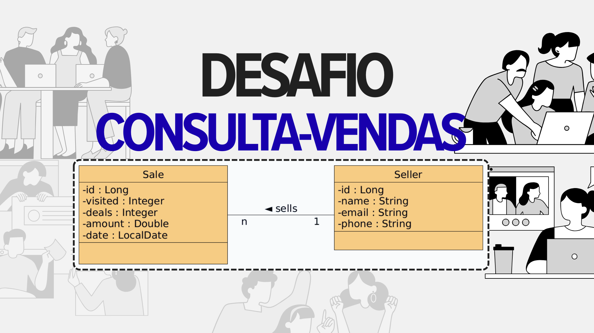

# 📊 Sistema de Consulta de Vendas
<p align="center">
  
</p>

Projeto desenvolvido como parte do desafio do módulo de **Back-end (JPA, SQL e JPQL)**, com foco na construção de consultas eficientes utilizando **Spring Boot + JPA**.

---

## 🚀 Tecnologias utilizadas

* Java 17+
* Spring Boot
* Spring Data JPA
* Hibernate
* H2 Database (ou outro configurado)
* Maven

---

## 📌 Objetivo do projeto

Implementar consultas personalizadas para um sistema de vendas, permitindo:

* 📄 Relatório detalhado de vendas (com paginação)
* 📈 Sumário de vendas por vendedor (com agregação)

---

## 🧩 Modelo de domínio

O sistema é composto por duas entidades principais:

* **Sale (Venda)**
* **Seller (Vendedor)**

📌 Relação:

* Uma venda pertence a um vendedor
* Um vendedor pode possuir várias vendas

---

## 🔍 Funcionalidades

### 📄 Relatório de vendas

Retorna uma listagem paginada contendo:

* ID da venda
* Data
* Valor
* Nome do vendedor

#### 🔹 Endpoint:

```http
GET /sales/report
```

#### 🔹 Parâmetros opcionais:

* `minDate` (yyyy-MM-dd)
* `maxDate` (yyyy-MM-dd)
* `name` (trecho do nome do vendedor)

#### 🔹 Exemplo:

```http
GET /sales/report?minDate=2022-05-01&maxDate=2022-05-31&name=odinson
```

---

### 📈 Sumário de vendas por vendedor

Retorna a soma total de vendas agrupadas por vendedor.

#### 🔹 Endpoint:

```http
GET /sales/summary
```

#### 🔹 Parâmetros opcionais:

* `minDate`
* `maxDate`

#### 🔹 Exemplo:

```http
GET /sales/summary?minDate=2022-01-01&maxDate=2022-06-30
```

---

## ⚙️ Regras de negócio

* Se `maxDate` não for informado → usa a data atual
* Se `minDate` não for informado → considera 1 ano antes de `maxDate`
* Se `name` não for informado → considera string vazia (`""`)

---

## 🧠 Conceitos aplicados

* Projeções com DTO
* Consultas JPQL personalizadas
* Uso de `GROUP BY` e `SUM`
* Paginação com `Pageable`
* Boas práticas em camadas (Controller → Service → Repository)

---

## 🧪 Testes

As requisições podem ser testadas via:

* Postman
* Insomnia
* Browser (para testes simples)

### 🔗 Endpoints para teste

#### 📄 Relatório de vendas

```http
GET http://localhost:8080/sales/report
```

```http
GET http://localhost:8080/sales/report?minDate=2022-05-01&maxDate=2022-05-31&name=odinson
```

#### 📈 Sumário de vendas

```http
GET http://localhost:8080/sales/summary
```

```http
GET http://localhost:8080/sales/summary?minDate=2022-01-01&maxDate=2022-06-30
```

---

## ▶️ Como executar o projeto

```bash
# Clonar repositório
git clone git@github.com:Medeiroshenrique/desafio-consulta-vendas.git

# Entrar na pasta
cd desafio-consulta-vendas/

# Executar
./mvnw spring-boot:run
```

---

## 📁 Estrutura do projeto

```bash
src/main/java/com/devsuperior/dsmeta
├── controllers
├── services
├── repositories
├── dto
├── entities
```

---

## 📌 Autor

**Henrique Medeiros**
🔗 LinkedIn: [https://www.linkedin.com/](https://www.linkedin.com/in/medeiroshenrique/)
💻 Portfólio: [https://henriquemedeirosportifolio.netlify.app](https://henriquemedeirosportifolio.netlify.app)

---

## 🏁 Status

✅ Concluído
📚 Projeto educacional
